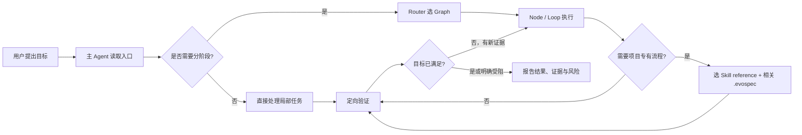

# Graph + Loop + Skill 框架：是什么、怎么运行、如何在项目中使用

> 本文对应当前目录中的实际文件。它是一个**项目级 Agent 工作协议模板**，不是需要启动的 Web 服务，也不是 LangGraph 程序。阅读版见 [HTML 图解](PROJECT_EXPLAINED.html)。

## 一眼看懂

```text
你的任务
  └─ Agent 读取 AGENTS.md（Claude Code 另读 CLAUDE.md）
      └─ 需要分阶段时选 Graph：目标、权限、停止条件
          └─ 在节点内用 Loop：观察 → 决定 → 行动 → 验证 → 调整
              └─ 仅需项目专有流程时选 Skill/reference
                  └─ 从 .evospec 读取真实配置与启用规则
                      └─ 调用本地文件、Shell、Git、测试等工具，留下证据
```

核心区别：**Graph 管路线，Loop 管迭代，Skill 管可复用的项目化方法，`.evospec` 管当前项目的真实值，Harness 是 Agent 可使用的文件系统、Shell、Git、测试等工具。** 它们不是五个需要分别启动的进程。

| 层 | 主要文件 | 解决的问题 |
|---|---|---|
| 入口与边界 | [`AGENTS.md`](../AGENTS.md)、[`CLAUDE.md`](../CLAUDE.md) | 何时读哪些文件、哪些本地动作可直接做、何时需要授权 |
| Graph | [`.agent/router.yaml`](../.agent/router.yaml)、[`.agent/graphs/`](../.agent/graphs/) | 按任务目标选择开发、修复、审查、问答等路线 |
| Loop / Node | [`.agent/loops/`](../.agent/loops/)、[`.agent/nodes/`](../.agent/nodes/) | 小步执行、定向验证、失败后修正或停止 |
| Skill | [`.agent/skills/model-skill/SKILL.md`](../.agent/skills/model-skill/SKILL.md)、[registry](../.agent/skills/registry.yaml) | 按需索引构建、部署、记录等项目专有流程 |
| 项目数据 | [`.agent/project.yaml`](../.agent/project.yaml)、[`.evospec/module.config.yaml`](../.evospec/module.config.yaml)、[规则](../.evospec/rules/INDEX.md) | 项目门禁、路径、命令、目标、适用规则 |
| 证据与状态 | [`scripts/`](../scripts/)、[状态模板](../.agent/state-template.json) | 实际命令结果；长任务才需要可恢复的 run state |

`model-skill` 是内置的**可选** Skill：普通代码问答或局部编辑不会因为属于某个 Graph 就自动加载它。全局 Jev Skill 若另行使用，也不需要写进本项目的 Skill 注册表。

## 它怎样运行



1. **选择路线。** Agent 依据用户目标和证据决定是否参考 Router/Graph；一个简单解释问题可以直接回答。Graph 是 Markdown/YAML 协议，**不会由某个后台引擎自动执行**。
2. **按需加载。** 只有要用 `.evospec` 项目专有能力时才查 Skill registry；`SKILL.md` 是轻量目录，再打开本次所需的一个或少数 reference，不预读全部 11 个。
3. **行动并验证。** Agent 在授权范围内编辑文件、运行已确认安全的本地命令；行为变更跑相关测试，构建/集成受影响时跑相应构建。失败后基于新证据修正，而非固定跑完整套 build/test/review。
4. **按风险升级。** 安全关键、跨模块或用户要求时使用独立只读 Reviewer；多阶段或跨会话任务可用 `scripts/new-run.py` 创建 `.agent/runs/*.json`，短任务不必建状态文件。
5. **完成或说明阻塞。** 交付请求的结果、实际验证和剩余风险。部署、push、目标端删除/覆盖、停止远端进程等高影响动作，必须获得针对具体目标的明确授权；不能把 `REQUIRED` 等模板占位符当成真实命令执行。

### 三种任务的实际路径

| 用户任务 | 预期路径 | 不会自动发生 |
|---|---|---|
| “解释这个函数” | 读取相关代码 → 回答 | 不加载全部 Skill、不建 run state、不跑全量测试 |
| “修复这个 Bug” | 定位证据 → 最小修复 → 相关复现/回归 | 不因修复完成自动部署、commit 或 push |
| “按项目配置构建” | `skill-workflow/build` → `us-build.md` → 检查策略与产物 | 构建成功不自动推板 |

## 先在模板目录验证什么

在**本框架目录**运行（下面命令检查协议和配置格式，不会启动 Agent 服务，也不代表业务项目构建成功）：

```bash
python3 scripts/validate-skills.py
python3 scripts/validate-framework.py
python3 scripts/validate-evospec.py
```

当前 `.evospec` 仍是模板，有未填写的 `REQUIRED` 字段；因此最后一条可以返回 `WARN`。接入真实项目并填好本次要使用的配置后，可再运行 `python3 scripts/validate-evospec.py --strict`。**不要在模板上直接执行部署或 push。**

只有需要跨阶段记录时才运行：

```bash
python3 scripts/new-run.py "修复登录失败"
```

它会写入 `.agent/runs/`；这不是每次任务的启动命令。`scripts/build.sh`、`scripts/test.sh` 等是业务项目的命令包装器，需先在 [`scripts/project-commands.sh`](../scripts/project-commands.sh) 配置或确认自动检测结果；不要把静态校验与真正的构建/测试混为一谈。

## 在现有项目中接入

1. **复制框架到目标仓库根目录。** 保留 `AGENTS.md`、`.agent/`、`scripts/`；若使用 `.evospec` 专有流程，连同 `.evospec/` 复制。按工具选择 `.codex/`、`.claude/`、`.pi/` 适配目录；不使用的平台目录可以省略。
2. **填项目事实。** 在 `.agent/project.yaml` 设置项目名、风险和门禁；在 `.evospec/module.config.yaml` 只填写准备使用的模块、路径、构建/调试等配置。未确认的设备、服务器、正式分支和凭据来源保持禁用或未解析；不要复制模板示例值。
3. **校准命令与规则。** 检查 `scripts/project-commands.sh` 的真实 build/test/lint 命令与 `.evospec` 一致；审阅 `.evospec/rules/INDEX.md` 的规则适用性。只对要使用的能力做相应安全校验。
4. **让 Agent 在目标仓库工作。** 打开该仓库的 Codex、Claude Code 或 Pi 会话，用普通自然语言下达任务。需要时显式说“使用 Graph/Loop”或“使用 model-skill 的 build route”；不必每次强制声明 Skill。
5. **按风险验收。** 看实际修改、相关测试/构建结果和未验证范围；远端部署、push 等单独授权。

复制后可先问 Agent：

```text
请只检查本项目的 AGENTS.md、相关 Graph 与当前 .evospec 配置，
说明哪些能力已可用、哪些配置仍未确认；不要执行构建、部署或 push。
```

日常示例：

```text
修复登录超时：先定位根因，做最小改动，运行相关测试并报告证据。
如果确实需要项目配置驱动的命令，再加载对应的 model-skill reference。
不要部署、commit 或 push。
```

使用专有构建流程的示例：

```text
使用本项目 model-skill 的 build route，按已确认的构建策略执行本地构建，
报告命令、退出码和产物；不要自动部署。
```

## 常见误解

- **“Graph = LangGraph 吗？”** 不是。这里的 Graph 是给 Agent 遵循的协议文件；若以后接入 LangGraph，那是额外实现。
- **“运行框架 = 执行 `scripts/verify.sh` 吗？”** 不是。常规工作只做与改动相关的验证，`verify.sh` 仅在确需全套门禁时使用。
- **“每个任务都要多 Agent 吗？”** 不需要。Coordinator、Explorer、Reviewer 是可选职责；只有并行、隔离或独立审查确有价值时才拆分。
- **“Jev 会自动进入流程吗？”** 不会。全局 Jev Skill 可由任务明确调用或由其自身适用条件触发，本项目不必额外注册 Jev。
